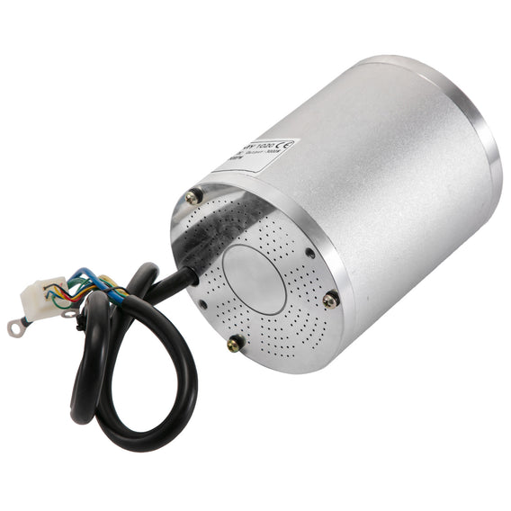
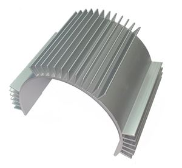
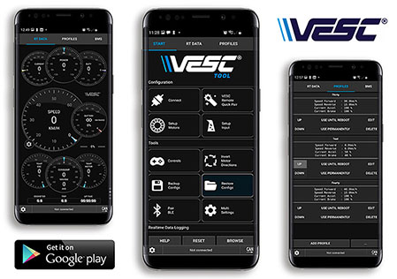
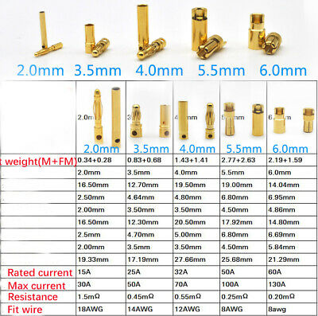
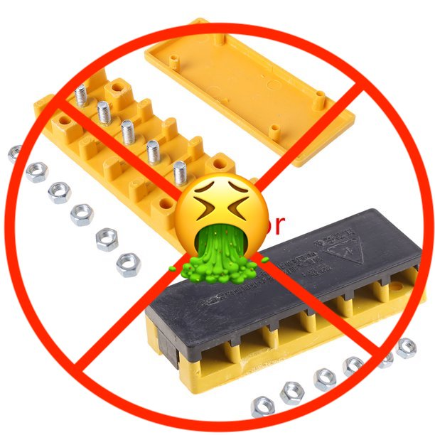
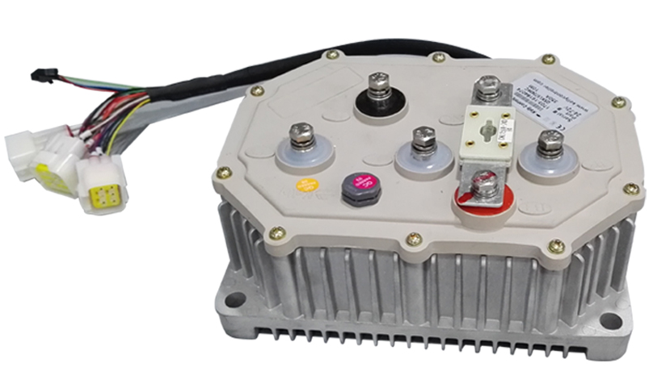

# MX500, 650 and RSF650

## Motors

* Brushless DC(BLDC) 1020 3000 watt
  * [Aliexpress](https://www.aliexpress.com/item/4000250072388.html?spm=a2g0o.order_list.0.0.21ef1802ozHCez), [Amazon](https://www.amazon.com/gp/product/B09GP415RF/ref=ppx_yo_dt_b_asin_title_o07_s00?ie=UTF8&psc=1)
  * Almost a direct fit.  Uses the same mount hole pattern.
  * You just need to drill about 5mm down the cover of your motor to allow the bolt to rest flat so you can mount it.  Stop drilling once the bolt is flush with the top of the cover.  If you drill too deep you will need to do something hacky with washers n shit.  I think its these two bolts:
    * 

  * [This motor](https://www.aliexpress.com/item/4000250072388.html?spm=a2g0o.order_list.0.0.21ef1802ozHCez) has been verified to handle 250 phase amps and about 100 battery amps though it gets hot fast.  
  * If you push it hard you'll need a heat sink like [this](http://www.pwmall.com/p-210643-50_126-delavan_heat_sink_fits_all_4_diameter_delavan_motors_7870_7970_7871_7971_fb_series):
    * 
  * Feel free to put [your old motor in your kid's 350](./350s.md#motor-upgrade)

## Controllers

* Little focer([US](https://www.makerspev.com/products/little-focer-rev3-standard?fromB=yes), [world wide](https://customwheel.shop/high-voltage-esc-motor-speed-controllers/little-focer-v3-esc-84v-20s?fromB=yes))
  * Highly recommended.  100 battery amps and about 225 phase amps.  Bluetooth android app for super easy programming.
  * Works with **brushed** and **brushless** motors so you can upgrade yur controller before even getting a brushless motor.
  *   
* [80a](https://www.amazon.com/gp/product/B09FHHZ9VM/ref=ppx_yo_dt_b_asin_title_o02_s02?ie=UTF8&psc=1)
  * Should be more waterproof than the VESC

## Battery

* [Electro and Company](https://www.electroandcompany.com/batteries) has a few to choose from
* [Greenway 48v battery](https://www.ebay.com/itm/255278257722)
* [50a battery](https://www.amazon.com/gp/product/B07V9LFNZK/ref=ppx_yo_dt_b_asin_title_o09_s00?ie=UTF8&th=1)
  * The charger sucks

## Throttle

* [Half twist key and volt display](https://www.amazon.com/gp/product/B08QF3MRHB/ref=ppx_yo_dt_b_search_asin_title?ie=UTF8&psc=1)
  * Half twist is good for not accidentally sending your bike through your door when bringing your bike inside.  Happens more than you would think.
  * Display is hard to see in the sun.
  * Grips will smell like cancer forever no matter how hard you try to clean it off.  Best to pick up [some better grips](https://www.amazon.com/gp/product/B08L4TGXGB/ref=ppx_yo_dt_b_search_asin_title?ie=UTF8&psc=1).  I think those will work for the half twist size but might be a bit big.  I like locking grips(bolt to lock it on the handlebars).

## Brakes

* [Zoom brakes](https://www.amazon.com/Zoom-Shenzhen-Hydraulic-Brakes-Mountain/dp/B081XN2KJL/ref=sr_1_3?crid=SH58WS6BQGRH&keywords=zoom+brakes&qid=1645588479&s=sporting-goods&sprefix=zoom+brakes%2Csporting%2C137&sr=1-3)
  * I think those work.  Someone please verify.
* I personally welded on some moped discs and calipers.  Works amazingly well and I never worry about heat.  

## Suspension fork

* The [sx500 fork](https://razor.com/products/replacement-parts/shop-by-product/electric-scooter-parts/sx500-front-fork/) seem like they wont work because they are different sizes than the mx and rsf forks.  
* The mx500 fork will work.  Good luck finding one thats in stock lolz.

## Rear shock

* [165mm](https://www.amazon.com/gp/product/B00FLTZ2ZS/ref=ppx_yo_dt_b_search_asin_title?ie=UTF8&psc=1) for stock height
* [190mm](https://www.amazon.com/gp/product/B07D1X18JH/ref=ppx_yo_dt_b_search_asin_title?ie=UTF8&psc=1) for 2 inch lift
  * A bit stiff.  Try and find a lower lb spring.
  * You will want to add some length to the front fork as well.  **Someone add a some deets for this.**

## Connectors

* [Small wire connectors](https://www.amazon.com/Swpeet-Automotive-Electrical-Connectors-Motorcycle/dp/B07DL6WRLP/ref=sr_1_6?crid=YVCEOCRL8ERG&keywords=2.8+with+terminals+Electrical+Wire+Connectors&qid=1645586926&sprefix=2.8+with+terminals+electrical+wire+connectors%2Caps%2C211&sr=8-6)([option 2](https://www.amazon.com/gp/product/B07BJGVJRG/ref=ppx_yo_dt_b_search_asin_title?ie=UTF8&psc=1))
  * Throttle, brake and hall wires for example
  * `2.8 with terminals Electrical Wire Connectors` is what they are called.
  * This is what most controllers use.
  * You will need a [crimper](https://www.amazon.com/gp/product/B01N1RFZZ4/ref=ppx_yo_dt_b_search_asin_title?ie=UTF8&psc=1)
* [XT90s](https://amzn.to/3BKHLG8) connectors for the battery is recommended to avoid sparking when plugging the battery into the controller.
  * Stick with the amass branded connectors.
  * They are rated for 100a.  If you have a 300a battery you can just use 3 connectors for example.
  * They can use up to [10 gauge silicone wire](https://amzn.to/3vbVEfs).  Any larger than that is a waste and hard to solder.
* [Bullet connectors](https://www.amazon.com/Generic-5-5mm-Gold-Bullet-Connector/dp/B01MRXLVRD/ref=sr_1_4?keywords=5.5mm+bullet+connector&qid=1645583504&sprefix=5.5mm+bull%2Caps%2C221&sr=8-4) for the motor phase wires.
  * See the image below for amp ratings.  I use 5.5mm bullets for everything because they do about 100 amps.  If I need more amps I just do 1 connector per phase per 100 amps.  I basically just match them up with the same number of [XT90s](https://amzn.to/3BKHLG8) connectors I use.  
    * 
  * Depending on the controller you get you'll want to replace the phase wires to use bullet connectors so that you don't have to use one of these shit boxes:
    * 
  * The shit boxes are nothing but problems because the plastic melts easily when the nuts come loose.  I have seen this many times and it usually doesn't end well and can take your controller down with it.
  * If your controller has built in phase wire mounts(like the one below) you should be fine to just go with whats built in.
    * 

## Tires

* Note that you will be looking for motorcycle tires because you have motorcycle rims.  Electric scooter type tires measure the diameter from the outer tread of the tire.  Motorcycle tires measure the diameter of the rim.  Don't buy scooter tires unless they say moped scooter.
* Rear
  * You need a 10 inch
  * Rear tire 3 inch max width for the rim
  * [Pirelli Angel Scooter Tires](https://www.revzilla.com/motorcycle/pirelli-angel-scooter-tires)
    * Pretty grippy on the road
    * Won't work with a heat sink without modifications
  * [MMG Bundle Combo Knobby Tire](https://www.amazon.com/gp/product/B010TLKLLW/ref=ppx_yo_dt_b_asin_title_o00_s01?ie=UTF8&psc=1)
* Front
  * 12 inch front tire
  * Front tire 2.75 maybe 3 inch max width for the rim
  * [16 inch scooter tire thats actually 12 inch motorcycle tire](https://cart.electricscooterparts.com/16x3-0-all-terrain-tread-electric-street-scooter-tire)
    * Kinda like an 80/20 tire meaning 80% road 20% off road
    * Because this tire is so wide be very careful when installing it on the rim.  The rim is pretty weak and can bend easily.  Be sure to use [some tire lube](https://www.amazon.com/gp/product/B01H6HMPRK/ref=ppx_yo_dt_b_search_asin_title?ie=UTF8&psc=1).
    * May have slightly less clearance but didn't bother me.
  * [Knobby Tire with Inner Tube 3.00-12 Front or Rear Trail Off Road Dirt](https://www.amazon.com/gp/product/B010TM2AYM/ref=ppx_yo_dt_b_asin_title_o08_s00?ie=UTF8&psc=1)
* How to and parts
  * [Good video](https://youtu.be/ToeaB1SpH2s)
  * Get [some tire lube](https://www.amazon.com/gp/product/B01H6HMPRK/ref=ppx_yo_dt_b_search_asin_title?ie=UTF8&psc=1) if you plan to replace your own tires.  Makes it a million times easier.
  * [A tire bead tool](https://www.amazon.com/gp/product/B00O8RWF5Y/ref=ppx_yo_dt_b_search_asin_title?ie=UTF8&psc=1) helps if you don't have someone to hold down your spoon
  * [These spoons](https://www.amazon.com/gp/product/B000QG0AKI/ref=ppx_yo_dt_b_search_asin_title?ie=UTF8&psc=1) are coo but honestly it doesn't matter as long as you lube up the tire.
  * **Don't [bend your spoon too far](https://youtu.be/ToeaB1SpH2s?t=187)** or you'll pop your tube.  Its pretty much guaranteed.

## Kits
  
* [Gerardo](https://www.facebook.com/gerardo.salas.31392410) kits
  * 3000w motor and 200a KVD7212NX controller will set you back about $585
  * 48v 2000w motor and a KVD7212N controller for $455
  * USPS flat rate shipping and insurance from a third party
  * $80 for a hydraulic disc brake kit
  * Message [Gerardo](https://www.facebook.com/gerardo.salas.31392410) on facebook for how to purchase a kit
* [Electro and Company](https://www.electroandcompany.com/buy-kits) seem good but a bit expensive.

## Other Parts

* These are good places to find random other parts
  * [Monster Scooter Parts](https://www.monsterscooterparts.com/)
  * [Electric Scooter Parts](https://electricscooterparts.com/index.html)
* [Handle bars](https://www.amazon.com/gp/product/B001FEJAE2/ref=ppx_yo_dt_b_asin_title_o03_s00?ie=UTF8&th=1)
* [#25 chain](https://www.amazon.com/gp/product/B018H9ZAD2/ref=ppx_yo_dt_b_asin_title_o01_s00?ie=UTF8&th=1)
* [Brake pads](https://www.amazon.com/gp/product/B08PQLYMNQ/ref=ppx_yo_dt_b_asin_title_o02_s00?ie=UTF8&psc=1)
* [Chain Breaker](https://www.amazon.com/gp/product/B083K6KFC3/ref=ppx_yo_dt_b_asin_title_o02_s01?ie=UTF8&psc=1)
* [Display](https://www.amazon.com/gp/product/B01HL0B5AU/ref=ppx_yo_dt_b_asin_title_o03_s00?ie=UTF8&psc=1)
* [Brake Caliper](https://www.amazon.com/gp/product/B015LLROWY/ref=ppx_yo_dt_b_asin_title_o07_s00?ie=UTF8&psc=1)
* [65T Rear Chain](https://www.amazon.com/gp/product/B07YWRB51F/ref=ppx_yo_dt_b_asin_title_o09_s00?ie=UTF8&psc=1)
* [Better Bearing](https://www.amazon.com/gp/product/B07GVNDQT6/ref=ppx_yo_dt_b_asin_title_o05_s00?ie=UTF8&psc=1)
* [Protect your charger](https://www.amazon.com/gp/product/B000XU5MEG/ref=ppx_yo_dt_b_asin_title_o08_s00?ie=UTF8&th=1)

## Build/Parts Videos

* [Lots of good parts](https://www.youtube.com/watch?v=yO52TyPi6_g)
* [Tire install](https://youtu.be/ToeaB1SpH2s)
