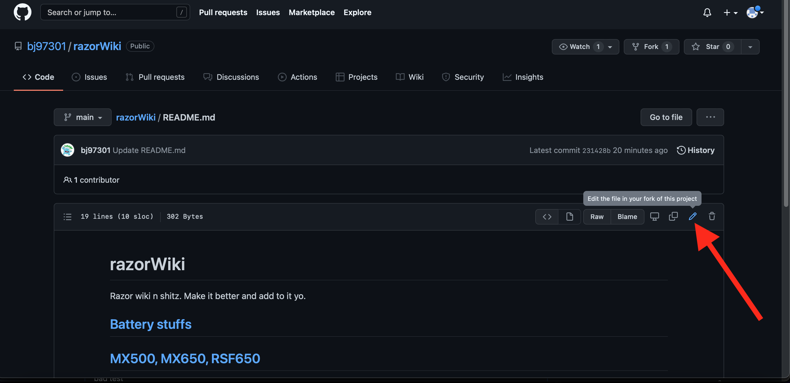
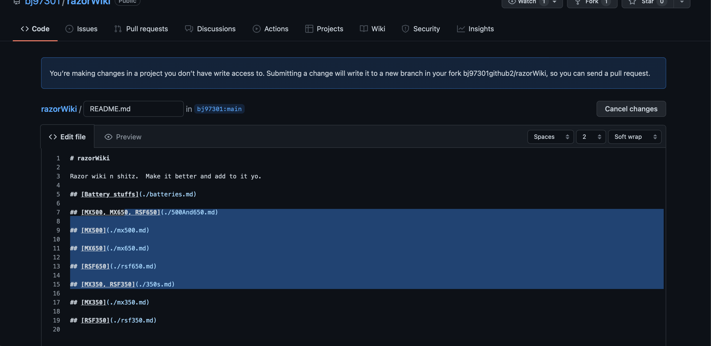
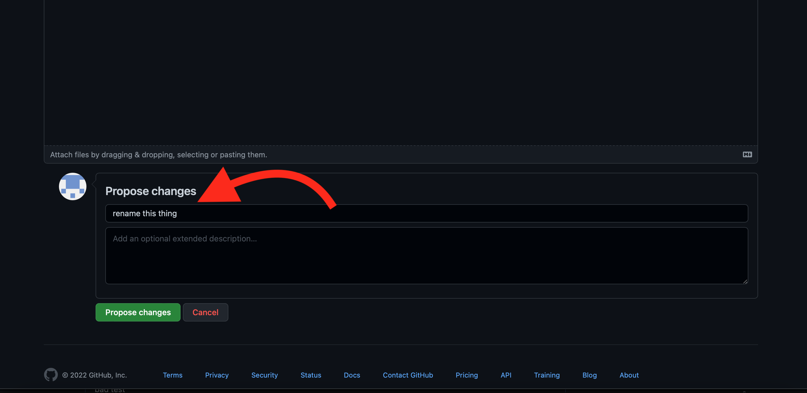
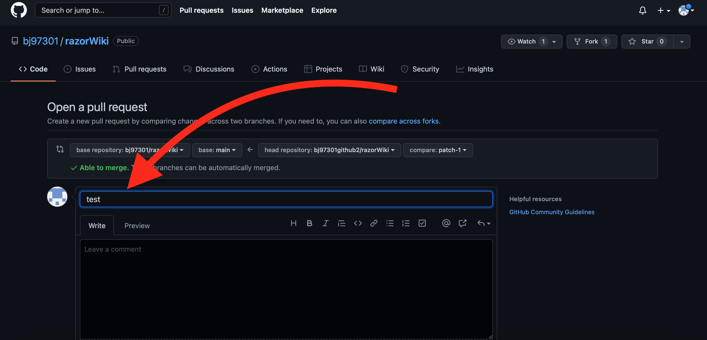
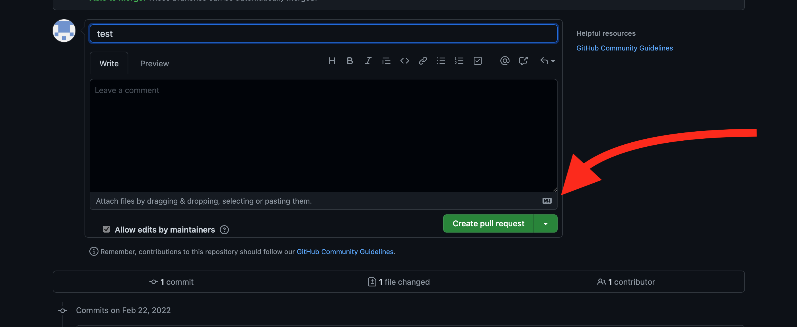
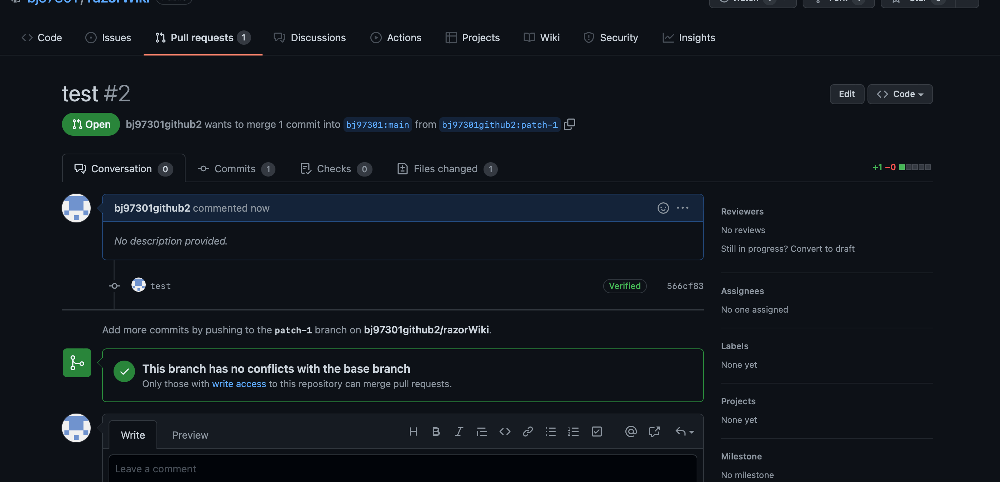

# How to contribute

* Click the edit button on the file you want to update.  You can do more than one file at a time. 
* Make changes.  Feel free to research markdown syntax if you want to learn something cool.
* Add a commit message.  Should attempt to be usefull like `rename this thing`
* Add details to your pull request(pr).  Something like `added guide for doing this to this bike`
* Click create pull request button then wait for my lazy ass to give feedback or add your changes to the main repository. 
* Yay you did a thing!  Now sit back and wait for someone else to do a thing. 