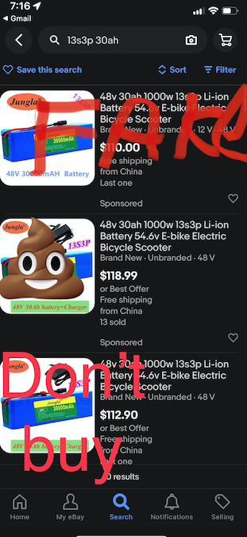

# Batteries

## Buying used lithium ion batteries

* When you first get the battery test the voltage from the discharge plug(the one with the thickest wires coming out). If way less than the rated voltage proceed with immense caution. The BMS shut itself off for some reason. The most likely reason is that the cells were under voltage and the BMS cut off the discharge port to prevent the cells from reaching a much lower voltage and causing permanent damage. To wake the bms up plug in the charger for about a minute then test the voltage again. Hopefully, it should be in a more reasonable range.  If the BMS does not turn itself back on I would return the battery. It’s not worth catching your house on fire 🔥.  The BMS has good reason to not turn itself back on, usually.  Do not attempt to continue charging it.
* When dealing with a battery that has been sitting for a while(even new batteries, or a battery that you haven’t used in a couple of months) the most dangerous time is during the first charge. **Stay close to the battery and be prepared to throw it outside.**. This is because the longer a battery sits the more likely they are to be out of balance.
* When you first receive the battery don’t fully discharge it.  In fact don’t discharged at all. This is because the cells may be out of balance. When you discharge a pack with out of balance cells you can potentially bring the lower cells to a way lower voltage that can cause permanent damage. You will want to charge it to 100% full so that the BMS can enter the balancing stage. If it’s a really old battery you can do this a couple of times to ensure that it’s balanced even better by discharging it slightly after reaching a full charge then charging it again. Once it’s charged you wanna let it sit overnight while being unplugged from the charger that way the balancing stage has plenty of time to complete. I’ve found that doing this twice is enough for most batteries to become fully balanced.
* When installing the battery it’s very important to not let it bounce around at all and to put padding anywhere the battery comes into contact with metal. [Closed cell foam type padding](https://www.amazon.com/Artilife-Neoprene-Perfect-Cosplay-Padding/dp/B08FX3V8Z7/ref=sr_1_7?keywords=closed+cell+foam&qid=1645587858&sprefix=closed+cell+%2Caps%2C266&sr=8-7) that bounces back after compression is needed. You probably got some in the shipping box that your battery came with.
* Check the plug for corrosion.  If there’s a lot of carbon buildup a.k.a. black stuff you may need to replace the plug. The plug should  be shiny and golden colored. Don’t just use a plug with a bunch of black stuff on it it’s going to melt away in no time.  Check both discharge and charge ports.
* If storing for the winter, discharge battery to between 50-70% charge. This will help keep the cells in balance.  Try to keep the batteries inside and not let them get too hot or cold. They like to be above freezing and below 40c. They also don’t like to be in a damp musky basement. If storing unused for more than a couple of weeks it’s a good idea to unplug them from the ev.  Use a multimeter to make sure the battery doesn’t have a slow drain. If so your battery may have an issue and you should proceed with caution. Batteries should be able to go 6 months or more without a significant drop in voltage while being stored.

## eBay

* I tried to find a cheap 30ah 48v battery on eBay, what a shit show. These eBay sellers are getting really bad. Don’t be fooled by the huge ah rating. There’s no possible way to cram that much capacity in a 3p battery. The cells would need to be 10,000 mah each. No 18650 can even come close to that and I highly doubt they are using larger cells.  I am sure the other specs are inflated as well like amp rating.  If you exceed the amp rating on the battery you may cause cells to pop and cause the whole pack to go up in flames during a full throttle pull, especially with a low quality BMS.  I messaged one of the sellers(screenshots below) to try and get the cell they are using so I could calculate the ah rating myself and they tried really hard to scam me. Please be careful on eBay. It may be an ok cheap battery when low amps are drawn but the specs are 100% fake.
  * 
  * <a href="ebayMessages.md" target="_blank">eBay messages from seller of scam item</a>
