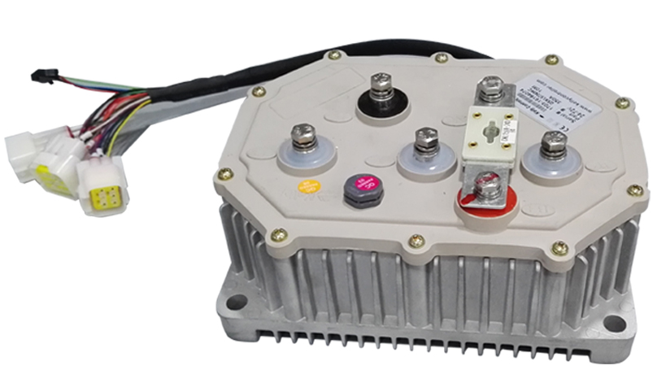

# MX500 and MX650

## Motor upgrade

* [Brushless 1020 3000 watt](https://www.aliexpress.com/item/4000250072388.html?spm=a2g0o.order_list.0.0.21ef1802ozHCez)
  * Almost a direct fit.  Uses the same mount hole pattern.
  * You just need to drill about 5mm down the cover of your motor to allow the bolt to rest flat so you can mount it.  Stop drilling once the bolt is flush with the top of the cover.  If you drill too deep you will need to do something hacky with washers n shit.  I think its these two bolts: 

  * [This motor](https://www.aliexpress.com/item/4000250072388.html?spm=a2g0o.order_list.0.0.21ef1802ozHCez) has been verified to handle 250 phase amps and about 100 battery amps though it gets hot fast.  
  * If you push it hard you'll need some heat sinks like [this]([http://someoneFindALinkPlzkthx](https://www.pwmall.com/p-210643-50_126-delavan_heat_sink_fits_all_4_diameter_delavan_motors_7870_7970_7871_7971_fb_series?fbclid=IwAR1qtVtE8GrEi5lMz8ljRAmksvRH3bCqQk6Q1Tn-cePhvMYAo2bQ8pyqhgA)): 

## Controllers

* Little focer([US](https://www.makerspev.com/products/little-focer-rev3-standard?fromB=yes), [world wide](https://customwheel.shop/high-voltage-esc-motor-speed-controllers/little-focer-v3-esc-84v-20s?fromB=yes))
  * Highly recommended.  100 battery amps and about 225 phase amps.  Bluetooth android app for super easy programming.  

## Connectors

* [XT90s](https://www.amazon.com/Amass-Connector-Anti-Spark-Battery-Charger/dp/B074PTHZ3M/ref=sr_1_2?crid=374B062FKB4N2&keywords=xt90s&qid=1645583218&sprefix=xt90%2Caps%2C344&sr=8-2) connectors for the battery is recommended to avoid sparking when plugging the battery into the controller.
  * Stick with the amass branded connectors.
  * They are rated for 100a.  If you have a 300a battery you can just use 3 connectors for example.
  * They can use up to [10 gauge silicone wire](https://www.amazon.com/10-Gauge-Silicone-Wire-Feet/dp/B007DMW3IU).  Any larger than that is a waste and hard to solder.
* [Bullet connectors](https://www.amazon.com/Generic-5-5mm-Gold-Bullet-Connector/dp/B01MRXLVRD/ref=sr_1_4?keywords=5.5mm+bullet+connector&qid=1645583504&sprefix=5.5mm+bull%2Caps%2C221&sr=8-4) for the motor phase wires.
  * See the image below for amp ratings.  I use 5.5mm bullets for everything because they do about 100 amps.  If I need more amps I just do 1 connector per phase per 100 amps.  I basically just match them up with the same number of XT90s connectors I use.  
  * Depending on the controller you get you'll want to replace the phase wires to use bullet connectors so that you don't have to use one of these shit boxes: 
  * The shit boxes are nothing but problems because the plastic melts easily when the nuts come loose.  I have seen this many times and it usually does'nt end well and can take your controller down with it.
  * If your controller has built in phase wire mounts(like the one below) you should be fine to just go with whats built in. 
