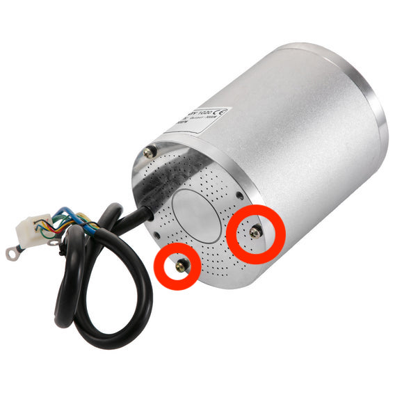
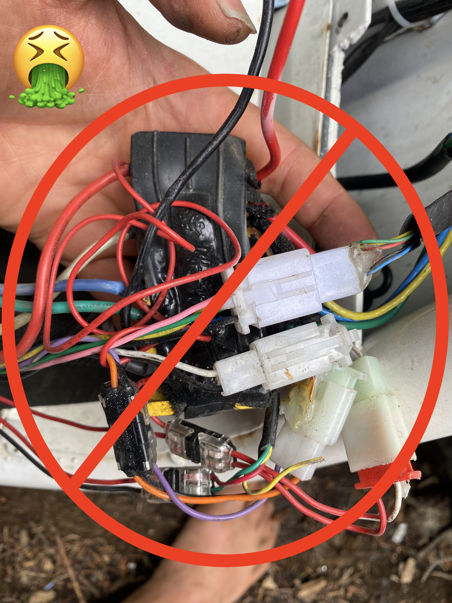

# RSF650

## Motor upgrade

* [Brushless 1020 3000 watt](https://www.aliexpress.com/item/4000250072388.html?spm=a2g0o.order_list.0.0.21ef1802ozHCez)
  * You will need to drill about 5mm down the cover of your motor to allow the bolt to rest flat so you can mount it.  Stop drilling once the bolt is flush with the top of the cover.  If you drill too deep you will need to do something hacky with washers n shit.  I think its these two bolts: 

  * This motor has been verified to handle 250 phase amps and about 100 battery amps though it gets hot fast.  
  * If you push it hard you'll need some heat sinks like [this]([http://someoneFindALinkPlzkthx](https://www.pwmall.com/p-210643-50_126-delavan_heat_sink_fits_all_4_diameter_delavan_motors_7870_7970_7871_7971_fb_series?fbclid=IwAR1qtVtE8GrEi5lMz8ljRAmksvRH3bCqQk6Q1Tn-cePhvMYAo2bQ8pyqhgA)): 

## Connectors

* [XT90s](https://www.amazon.com/Amass-Connector-Anti-Spark-Battery-Charger/dp/B074PTHZ3M/ref=sr_1_2?crid=374B062FKB4N2&keywords=xt90s&qid=1645583218&sprefix=xt90%2Caps%2C344&sr=8-2) connectors for the battery is recommended to avoid sparking when plugging the battery into the controller.
  * They are rated for 100a.  If you have a 300a battery you can just use 3 connectors for example. 
  * They can use up to [10 gauge silicone wire](https://www.amazon.com/10-Gauge-Silicone-Wire-Feet/dp/B007DMW3IU).  Any larger than that is a waste and hard to solder.
* [Bullet connectors](https://www.amazon.com/Generic-5-5mm-Gold-Bullet-Connector/dp/B01MRXLVRD/ref=sr_1_4?keywords=5.5mm+bullet+connector&qid=1645583504&sprefix=5.5mm+bull%2Caps%2C221&sr=8-4) for the motor phase wires
  * Depending on the controller you get you'll want to replace the phase wires to use bullet connectors so that you don't have to use one of these 